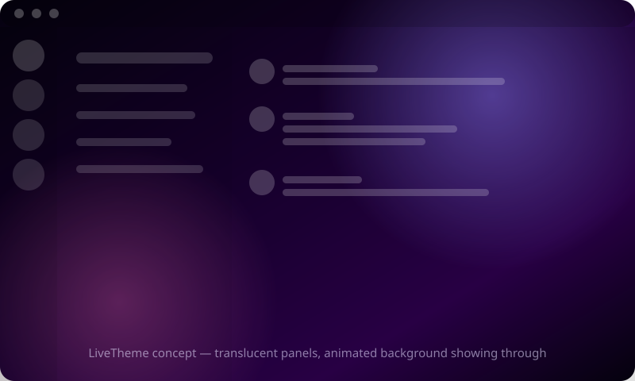
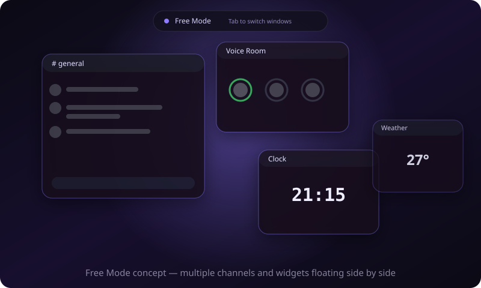

# Nebula

<p>
  <a href="LICENSE"></a>
  <a href="https://github.com/orange0730/nebula/issues"></a>
  <a href="https://github.com/orange0730/nebula/pulls"></a>
  <a href="https://github.com/Vendicated/Vencord"></a>
</p>

**Language:** [English](README.en.md) · 繁體中文

Nebula 是 [orange0730](https://github.com/orange0730) 基於 [Vencord](https://github.com/Vendicated/Vencord)
延伸開發的 Discord 客戶端修改工具。Vencord 提供底層的注入框架與外掛系統,Nebula 在其上加入了以下自製外掛:

- **LiveTheme** — 動態/即時背景系統
- **Free Mode(自由模式)** — 可自由拖放的多視窗聊天版面

歡迎 [提出 Issue](https://github.com/orange0730/nebula/issues/new/choose)、送 [Pull Request](CONTRIBUTING.md),
一起把這個專案做得更好。

## 功能

### LiveTheme:動態即時背景



> 上圖為示意圖,非真實螢幕截圖——歡迎透過 PR 或 Issue 附上你自己的實際使用截圖!

讓 Discord 的背景動起來,並讓聊天室/側欄面板變透明,透出背景:

- 背景模式:靜態圖片、循環播放影片、或動態 CSS 漸層(內建多種風格)
- 面板不透明度與模糊程度可調整,即時預覽
- 面板透明效果是透過 Discord 自身的 CSS 設計變數(如 `--chat-background`、`--panel-bg`)與
  `<nav>` 等語意化標籤選取器套用,而不是猜測容易變動的雜湊 class 名稱,再搭配一個執行時的
  DOM 掃描機制清除 App 根層(包含彈出視窗/設定畫面)的不透明背景。這個做法比傳統
  BetterDiscord 主題常見的「猜 class name」寫法更能撐過 Discord 版本更新。

### Free Mode:自由模式



畫面左上角有一個小按鈕(或按 `Ctrl+\``)可以切換進入「自由模式」——一個全螢幕的自由版面疊層,
把 Discord 變成一個可以自由排列視窗的迷你桌面:

- **視窗**:圓角玻璃感卡片,可拖動標題列移動、右下角拉伸縮放。每個視窗可以綁定一個頻道或私訊,
  或是下面提到的小工具。最小化與關閉是分開的操作。
- **鍵盤優先**:`Tab` / `Shift+Tab` 在視窗間切換焦點、`Ctrl+N` 開啟新增視窗選單、
  `Ctrl+W` 關閉目前視窗、`Esc` 依序關閉選單再關閉整個自由模式。
- **聊天視窗**是自己寫的輕量訊息渲染器,直接串接 Discord 內部的 `ChannelStore`
  /`MessageStore`/`MessageActions`(不是重用 Discord 原生的聊天元件,因為那個元件只能顯示
  單一頻道),並訂閱 Flux 的 `MESSAGE_CREATE`/`UPDATE`/`DELETE` 事件,讓多個同時開啟的視窗都
  能透過 Discord 既有的連線即時更新,而不是各自额外輪詢。
- **小工具**:語音室卡片(顯示目前通話成員,講話中的人頭像會亮綠框,串接
  `VoiceStateStore`/`ChannelRTCStore`)、即時時鐘、天氣卡片(使用免費、不需金鑰的
  [open-meteo](https://open-meteo.com) API)。
- **版面**:可以把目前的視窗排列存成一個命名版面,之後一鍵載入,不用每次重新排一次。

視覺風格參考了 [ilyamiro/nixos-configuration](https://github.com/ilyamiro/nixos-configuration)
這類 rice/compositor shell 的美學:暖色調深色背景、圓角膠囊型元件、單一強調色的柔光暈染。

尚未實作的已知項目:自由模式視窗開啟時抑制側欄未讀紅點、單一視窗通知靜音、視窗吸附/自動排列、
多螢幕拖曳。

## 快速開始

### 方法一:一行指令安裝(推薦,不需要裝 Node.js)

**Linux / macOS:**

```bash
curl -fsSL https://raw.githubusercontent.com/orange0730/nebula/main/scripts/install.sh | bash
```

**Windows(PowerShell):**

```powershell
irm https://raw.githubusercontent.com/orange0730/nebula/main/scripts/install.ps1 | iex
```

> ⚠️ Windows 版安裝腳本目前還沒有在真實 Windows 機器上實測過。如果安裝過程有問題,
> 歡迎[開 Issue](https://github.com/orange0730/nebula/issues) 回報,或直接送 PR 修。

這會下載 GitHub Actions 自動建置好的最新版本,加上 Vencord 官方的安裝器,直接幫你注入到本機
Discord,不需要自己 clone repo、裝 Node.js/pnpm。

### 方法二:從原始碼建置(開發者/想自己改程式碼)

需求:[Node.js](https://nodejs.org) 22 以上、[pnpm](https://pnpm.io)、已安裝好的 Discord 桌面版。

```bash
# 1. Clone 這個 repo
git clone https://github.com/orange0730/nebula.git
cd nebula

# 2. 安裝相依套件
pnpm install

# 3. 建置
pnpm build

# 4. 注入到本機 Discord
pnpm inject
```

不管用哪種方法,安裝器執行後會跳出互動式選單,選擇偵測到的 Discord 安裝路徑(或手動輸入自訂路徑),
完成後**重新啟動 Discord**。啟動後:

1. 打開 Discord 設定 → Vencord → Plugins,分別啟用 **LiveTheme** 和 **NebulaFreeMode**
2. LiveTheme:點插件旁齒輪圖示開啟設定面板,選擇背景模式並調整不透明度/模糊
3. Free Mode:回到一般畫面,點左上角的小方塊圖示(或按 `Ctrl+\``)進入自由模式,
   按「＋新增視窗」選擇頻道/私訊或小工具

> ⚠️ 如果你的 Discord 是透過 **snap** 安裝的,它的安裝目錄是唯讀的,無法直接注入。
> 需要改用官方 tar.gz/deb 安裝方式(從 [discord.com](https://discord.com/download) 下載)。

疑難排解、如何手動指定 Discord 路徑等細節,請參考
[Vencord 官方文件](https://github.com/Vendicated/Vencord)(Nebula 沿用 Vencord 的注入機制)。

## 貢獻

歡迎任何形式的貢獻——回報錯誤、提出功能建議、直接送 PR 都可以。詳見 [CONTRIBUTING.md](CONTRIBUTING.md)。

## 授權與致謝

本專案是 [Vencord](https://github.com/Vendicated/Vencord)(由 Vendicated 與其貢獻者開發)的衍生作品,
沿用 Vencord 原本的 **GNU General Public License v3.0(GPL-3.0)**,完整條款見專案根目錄的
[LICENSE](LICENSE)。

GPL-3.0 是一個 copyleft 授權,重點是:

- 可以自由修改、散布,包含公開在 GitHub 上,不需另外取得許可。
- 衍生作品(也就是本專案)必須沿用同一份 GPL-3.0 授權,不能改成更嚴格或封閉的授權。
- 必須保留原始著作權聲明——Vencord 原始碼各檔案中既有的著作權標頭(例如
  `Copyright (c) 2022 Vendicated and contributors`)予以保留,不會被移除或竄改。
- 必須提供原始碼(本 repo 本身就是公開原始碼,已符合)。

因此以 Vencord 為基礎延伸開發、公開這個 fork,在授權上是被允許且合規的,不構成侵權。這個 repo
的 git commit 記錄只保留 `orange0730` 一個作者身份(沒有沿用 Vencord 原本數千筆的個別 commit
紀錄),這只是 git 歷史記錄的呈現方式,不影響前述 GPL 合規性——原始碼檔案內既有的著作權標頭仍然
完整保留,且本文件已清楚註明專案是基於 Vencord 延伸,滿足歸屬揭露的精神。

## Vencord 是什麼

> The cutest Discord client mod
>
> - 100+ 內建外掛、易於安裝、支援任何 Discord 版本(Stable/Canary/PTB)
> - 支援瀏覽器擴充套件/UserScript 運作
> - 內建 CSS/主題編輯器,可匯入 BetterDiscord 主題
> - 注重隱私:預設封鎖 Discord 的分析與錯誤回報遙測,無自家遙測
> - 積極維護,壞掉的外掛通常 12 小時內修好

更多資訊請見 [vencord.dev](https://vencord.dev) 或原始專案
[github.com/Vendicated/Vencord](https://github.com/Vendicated/Vencord)。

## Star History

如果這個專案對你有幫助,歡迎按個 ⭐️!

[](https://star-history.com/#orange0730/nebula&Date)
