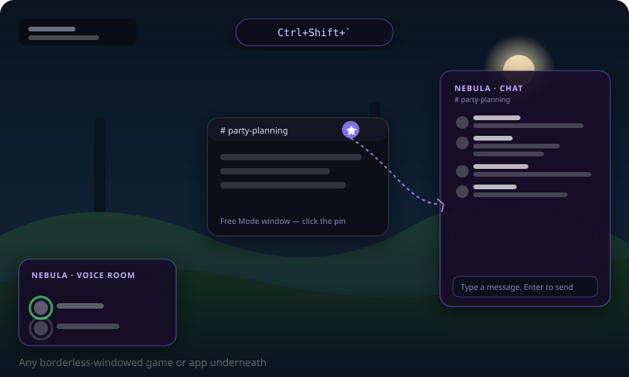

# Nebula

<p>
  <a href="LICENSE"></a>
  <a href="https://github.com/orange0730/nebula/issues"></a>
  <a href="https://github.com/orange0730/nebula/pulls"></a>
  <a href="https://github.com/Vendicated/Vencord"></a>
</p>

**Language:** English · [繁體中文](README.zh-TW.md)

Nebula is a Discord client mod built by [orange0730](https://github.com/orange0730) on top of
[Vencord](https://github.com/Vendicated/Vencord). Vencord provides the underlying injection framework and
plugin system; Nebula adds the following custom plugins on top of it:

- **LiveTheme** — dynamic/live background system
- **Free Mode** — a freeform, draggable multi-window chat layout

Issues and [pull requests](CONTRIBUTING.md) are welcome — help make this project better.

## Features

### LiveTheme: dynamic live backgrounds


> The image above is a concept illustration, not a real screenshot — feel free to open a PR or issue with your
> own real-world screenshots!

Brings Discord's background to life and makes the chat/sidebar panels translucent to show it through:

- Background modes: static image, looping video, or an animated CSS gradient (several built-in presets)
- Panel opacity and blur sliders with a live preview
- Panel transparency is applied via Discord's own CSS design tokens (e.g. `--chat-background`, `--panel-bg`)
  and semantic `<nav>` selectors, rather than guessing hashed classnames, plus a runtime DOM walker that
  neutralizes the app's opaque background chain (including inside modals/dialogs). This is intentionally more
  resilient to Discord client updates than the classic BetterDiscord approach of guessing hashed CSS class
  names.

### Free Mode


A small button in the top-left corner (or `Ctrl+\``) toggles "Free Mode" — a full-screen freeform overlay that
turns Discord into a mini draggable-window desktop:

- **Windows**: rounded glass cards, draggable by their titlebar and resizable from the bottom-right corner.
  Each window is bound to a channel/DM you pick, or one of the widgets below. Minimize and close are distinct
  actions.
- **Keyboard-first**: `Tab` / `Shift+Tab` cycles focus between windows, `Ctrl+N` opens the add-window picker,
  `Ctrl+W` closes the focused window, `Esc` closes menus then the whole overlay.
- **Chat windows** use a custom lightweight message renderer built directly on Discord's `ChannelStore` /
  `MessageStore` / `MessageActions` (not Discord's own single-instance chat component), subscribing to Flux
  `MESSAGE_CREATE`/`UPDATE`/`DELETE` events so multiple simultaneously open windows update live over Discord's
  existing connection instead of polling.
- **Widgets**: a voice-room card (current call participants, a green ring around whoever's speaking, via
  `VoiceStateStore`/`ChannelRTCStore`), a live clock, and a weather card (via the free, keyless
  [open-meteo](https://open-meteo.com) API).
- **Workspaces**: save the current window arrangement under a name and reload it later in one click.

Visual direction inspired by rice/compositor shells like
[ilyamiro/nixos-configuration](https://github.com/ilyamiro/nixos-configuration): warm-toned dark backgrounds,
rounded pill-shaped widgets, soft single-accent-color glow.

Known gaps not yet built: unread-badge suppression for channels open in a Free Mode window, per-window
notification muting, snapping/tiling presets, multi-monitor window dragging.

### In-game overlay



Pin any Free Mode window to a standalone, always-on-top overlay that floats above every other window on your
screen — including fullscreen-borderless games, so you can keep an eye on chat or your voice room without
alt-tabbing out.

1. Open Free Mode and add a channel window or the voice-room widget as usual.
2. Click the 📌 pin icon in that window's titlebar (next to minimize/close). The icon lights up purple once pinned.
3. Press **`Ctrl+Shift+\``** anywhere — even outside Discord — to show or hide all pinned overlays at once.

Each pinned window gets its own overlay, positioned and sized to match that window's live position in Free Mode
(drag or resize the Free Mode window and the overlay follows), clamped to stay fully on-screen. A channel overlay
shows the last 8 messages, read-only chat, plus an input box at the bottom — type and hit Enter to send without
switching back to Discord. A voice-room overlay shows the current call's participants with a speaking indicator
and mute/deafen status.

This is a real OS-level window (not a DirectX/game-engine hook), so it only works over borderless-windowed or
windowed games, not exclusive fullscreen — and it can't render inside third-party fullscreen capture surfaces the
same way Discord's own overlay can't either.

## Quick start

### Option 1: one-line install (recommended, no Node.js required)

**Linux / macOS:**

```bash
curl -fsSL https://raw.githubusercontent.com/orange0730/nebula/main/scripts/install.sh | bash
```

**Windows (PowerShell):**

```powershell
irm https://raw.githubusercontent.com/orange0730/nebula/main/scripts/install.ps1 | iex
```

> ⚠️ The Windows install script hasn't been tested on a real Windows machine yet. If something breaks,
> please [open an issue](https://github.com/orange0730/nebula/issues) or send a PR fixing it.

This downloads the latest build (produced automatically by GitHub Actions) plus Vencord's official installer,
and injects Nebula into your local Discord install directly — no need to clone the repo or install Node.js/pnpm.

### Option 2: build from source (for developers / if you want to modify the code)

Requirements: [Node.js](https://nodejs.org) 22+, [pnpm](https://pnpm.io), and Discord desktop already installed.

```bash
# 1. Clone this repo
git clone https://github.com/orange0730/nebula.git
cd nebula

# 2. Install dependencies
pnpm install

# 3. Build
pnpm build

# 4. Inject into your local Discord install
pnpm inject
```

Either way, the installer opens an interactive picker — select your detected Discord install (or enter a
custom path), then **restart Discord**. After that:

1. Open Discord Settings → Vencord → Plugins, and enable both **LiveTheme** and **NebulaFreeMode**
2. LiveTheme: click the gear icon next to the plugin to open its settings, pick a background mode, and adjust
   opacity/blur
3. Free Mode: back in the normal view, click the small square icon in the top-left corner (or press `Ctrl+\``)
   to enter Free Mode, then click "Add Window" to pick a channel/DM or widget

> ⚠️ If your Discord was installed via **snap**, its install directory is read-only and can't be injected into
> directly. Use the official tar.gz/deb install instead (from [discord.com](https://discord.com/download)).

For troubleshooting, manually specifying a Discord path, etc., see the
[official Vencord docs](https://github.com/Vendicated/Vencord) (Nebula uses the same injection mechanism).

## Contributing

Contributions of any kind are welcome — bug reports, feature ideas, or PRs directly. See
[CONTRIBUTING.md](CONTRIBUTING.md).

## License & attribution

This project is a derivative work of [Vencord](https://github.com/Vendicated/Vencord) (by Vendicated and
contributors), licensed under the same **GNU General Public License v3.0 (GPL-3.0)** — full text in
[LICENSE](LICENSE).

GPL-3.0 is a copyleft license. In short:

- You may freely modify and redistribute it, including publishing publicly on GitHub, without needing separate
  permission.
- A derivative work (this project) must stay under the same GPL-3.0 license — it cannot be relicensed under
  something more restrictive or closed.
- Existing copyright notices must be preserved — the copyright headers already present in Vencord's source
  files (e.g. `Copyright (c) 2022 Vendicated and contributors`) remain untouched.
- Source code must be made available (this repo is public source, so that's satisfied).

Publishing this fork, built on Vencord, is therefore permitted and compliant, not an infringement. This repo's
git commit history only carries a single author identity (`orange0730`), rather than Vencord's original
several-thousand individual commits — that's purely a presentation choice about *this* repo's commit log and
doesn't affect the GPL compliance above: the copyright headers already embedded in the source files are fully
intact, and this document clearly states the project is derived from Vencord, satisfying the spirit of
attribution disclosure.

## What is Vencord

> The cutest Discord client mod
>
> - 100+ built-in plugins, easy to install, works on any Discord branch (Stable/Canary/PTB)
> - Works in your browser via extension or UserScript
> - Built-in CSS/theme editor, can import BetterDiscord themes
> - Privacy-friendly: blocks Discord's analytics and crash reporting by default, no telemetry of its own
> - Actively maintained, broken plugins are usually fixed within 12 hours

More info at [vencord.dev](https://vencord.dev) or the original project at
[github.com/Vendicated/Vencord](https://github.com/Vendicated/Vencord).

## Star History

If this project is useful to you, consider giving it a ⭐️!

[](https://star-history.com/#orange0730/nebula&Date)
